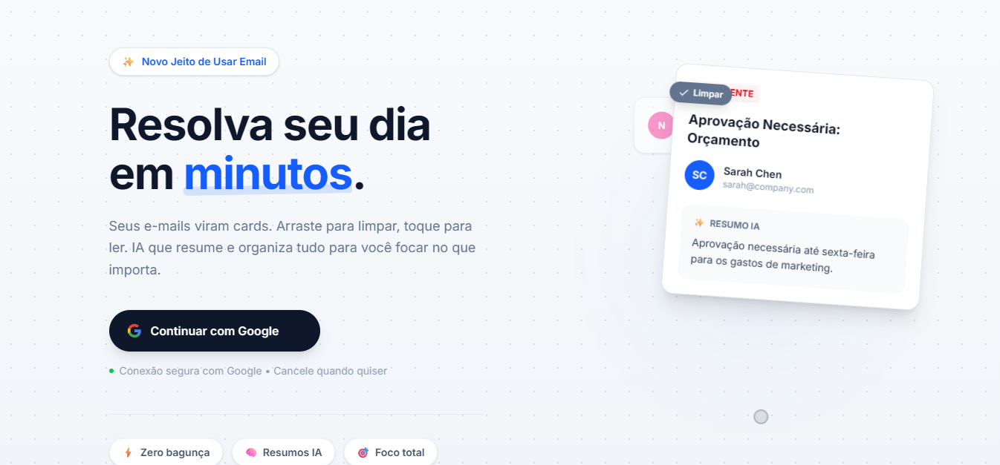
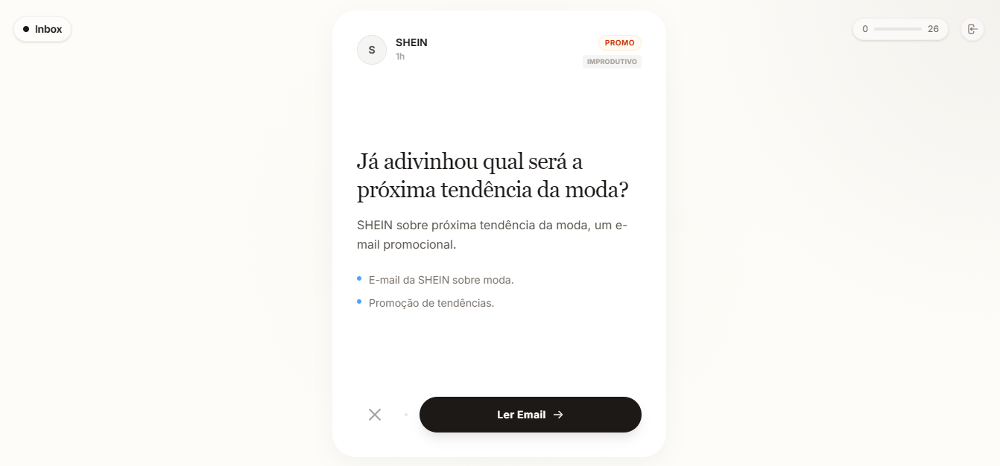

# EmailManager Interface

<div style="display: flex; gap: 10px;">
  
  
</div>

<br />

This is a [Next.js](https://nextjs.org) project bootstrapped with [`create-next-app`](https://nextjs.org/docs/app/api-reference/cli/create-next-app).

## Getting Started

First, run the development server:

```bash
npm run dev
# or
yarn dev
# or
pnpm dev
# or
bun dev
```

Open [http://localhost:3000](http://localhost:3000) with your browser to see the result.


Para utilizar a funcionalidade de e-mail do google e IA crie um .env com:
# Google OAuth (from console.cloud.google.com)
GOOGLE_CLIENT_ID=your-client-id.apps.googleusercontent.com
GOOGLE_CLIENT_SECRET=your-client-secret

# Gemini API (from aistudio.google.com)
GEMINI_API_KEY=your-gemini-api-key

# NextAuth
AUTH_SECRET=generate-a-random-32-character-string-here
NEXTAUTH_URL=http://localhost:3000
